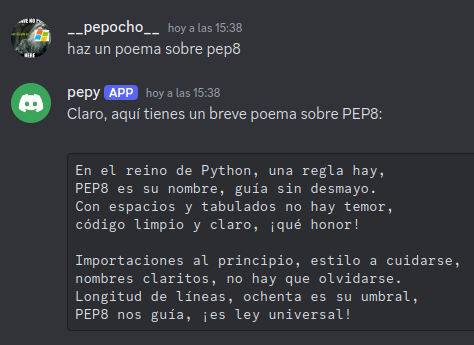

# Quickstart
- Obtener el `DS_TKN` del bot en https://discord.com/developers/applications
- Crear el archivo `.env` y dentro colocar el token.
```bash
PATH_CFG_DS=data/cfg_ds.json
DS_TKN=...
OAI_API_KEY=...
```
